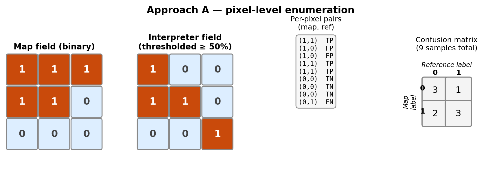
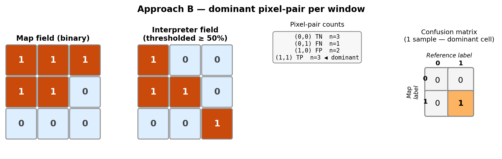
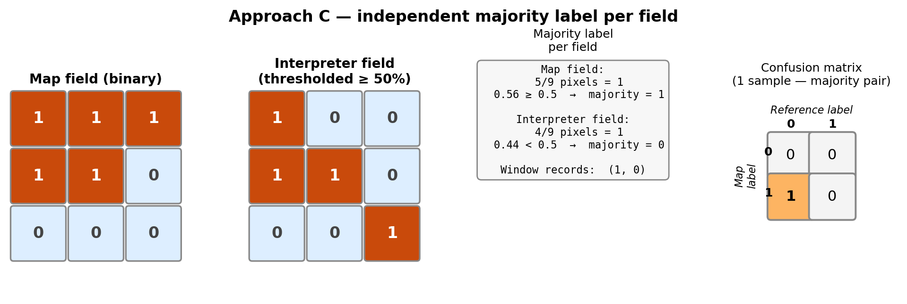
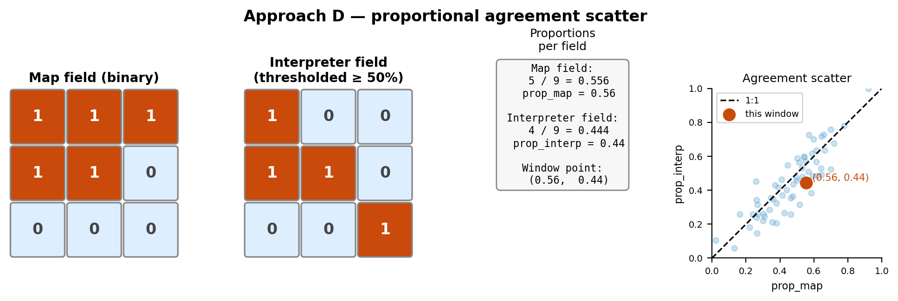

# Window-Based Sampling Approaches for Binary Accuracy Assessment

## Overview

Traditional accuracy assessment treats each sampled pixel as an independent
observation: a single location is visited, classified by the map, labeled by
an interpreter, and the (map class, reference class) pair is entered into a
confusion matrix. This framework assumes that the unit of observation is a
point.

The approaches described here generalize the sampling unit from a single pixel
to a **W × W window** of pixels. For a given window, the binary map field and
the interpreter probability field (thresholded at 50%) are both extracted, and
the window is summarized in one of four ways before being entered into the
accuracy assessment. Window centers are placed by **random sequential
adsorption**: candidate centers are drawn uniformly at random from the valid
inset region, and each is accepted only if its window does not overlap any
previously accepted window. This avoids the grid artifacts that arise from
fixed tiling when window size and patch size are related.

All four approaches share the same backbone and parameter set
(`window_size`, `n_windows`, `sampling_seed`). Setting `window_size = 1`
recovers the classical per-pixel random sample as a special case of the
general framework.

The figures below illustrate each approach using a single 3 × 3 example
window. Brick-red cells indicate class 1 (disturbed); pale-blue cells indicate
class 0 (undisturbed).

---

## Approach A — Pixel-Level Enumeration

Every pixel within the window contributes one observation to the confusion
matrix. For a W × W window, W² (map class, reference class) pairs are
recorded. This is mathematically equivalent to the classical per-pixel
approach, but sampling units are drawn as spatially contiguous windows rather
than isolated points. When `window_size = 1` this reduces exactly to the
standard design.

The result feeds directly into a standard confusion matrix and Olofsson-style
area estimation.

---

## Approach B — Dominant Pixel-Pair per Window

All W² pixel pairs within the window are tallied into the four possible
combinations — (0, 0), (0, 1), (1, 0), (1, 1) — and the **most frequent
combination** is identified. The window contributes exactly **one count** to
the confusion matrix, placed at that dominant cell. Ties are broken by
preferring (1, 1) over (0, 0) over (1, 0) over (0, 1).

This approach compresses within-window information to a single representative
outcome, reducing the influence of spatially autocorrelated pixel errors while
preserving the map × reference cell structure.

---

## Approach C — Independent Majority Label per Field

The majority label is computed **independently** for the map field and the
interpreter field: a window is assigned map class 1 if more than half its
pixels are classified as disturbed, and interpreter class 1 if more than half
its interpreter probabilities exceed 50%. The (majority_map, majority_interp)
pair is recorded as one sample per window.

Unlike Approach B, which selects the most common pixel-level agreement pattern,
Approach C derives a label for each field separately before comparing them.
This means a window where the map and interpreter fields each show slight
majorities for opposite classes will record a disagreement, even if no single
pixel pair captures that disagreement on its own.

---

## Approach D — Proportional Agreement Scatter

Rather than binarizing at the window level, each window is summarized by two
continuous proportions: the fraction of map pixels classified as disturbed
(`prop_map`) and the fraction of interpreter pixels labeled as disturbed
(`prop_interp`). These are recorded as a (x, y) point and visualized as a
scatter plot against the 1:1 line.

Approach D does not produce a confusion matrix or an Olofsson area estimate.
Instead it provides a direct, continuous view of spatial agreement between the
map and the interpreter across all windows. Systematic offsets from the 1:1
line indicate directional bias; scatter around it indicates noise. Window size
controls the spatial scale at which agreement is assessed.

---

## Summary

| Approach | Unit of observation | Output | Feeds into Olofsson? |
|---|---|---|---|
| A | Pixel (W² per window) | (map_class, ref_class) per pixel | Yes |
| B | Window (dominant cell) | (map_class, ref_class) per window | Yes |
| C | Window (independent majority) | (map_class, ref_class) per window | Yes |
| D | Window (proportions) | (prop_map, prop_interp) per window | No — scatter plot |

Approaches A, B, and C produce DataFrames with identical schemas and feed
without modification into `binary_confusion_from_samples()` and
`olofsson_area_estimates()`, allowing direct comparison of area estimates
across sampling strategies.
